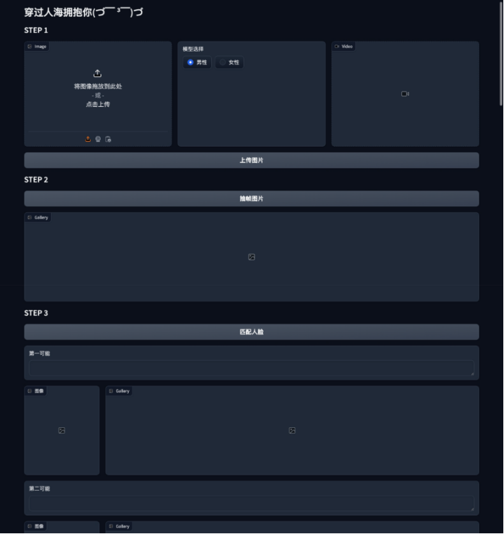

# AT-GAN

基于注意力机制的生成对抗网络(Attention-based GAN)实现。

## 项目结构

## 项目名称：AT-GAN跨年龄识别可视化网站

## 项目简介
本项目旨在实现一个基于深度学习的图像处理工具，支持跨年龄照片生成与人脸识别功能。

## 功能概述
列出项目的主要功能模块及其作用：

1. **数据加载与预处理**：支持多类别图像数据的加载和预处理。
2. **训练与可视化**：使用 Visdom 实时显示训练过程中的图像和损失曲线。
3. **结果保存**：支持将训练结果保存为图像、视频或 HTML 页面。
4. **部署模式**：支持将模型部署到生产环境，直接保存处理后的图像。

## 项目结构
简要介绍项目的文件结构和主要模块：

```
project_name/
├── data/
│   ├── base_dataset.py
│   ├── multiclass_unaligned_dataset.py
│   └── dataset_utils.py
├── models/
│   └── [模型文件]
├── util/
│   ├── util.py
│   └── html.py
├── visualizer.py
├── web.py
└── README.md
```

## 安装与依赖
列出项目所需的依赖库及其安装方法：

### 依赖库
- Python 3.7+
- PyTorch 1.7+
- Visdom
- NumPy
- OpenCV
- PIL
- Tqdm

### 安装方法
```bash
pip install torch torchvision visdom numpy opencv-python pillow tqdm
```


## 示例

```bash
# 开启网站
python web.py
```


## 联系方式
如果在使用过程中遇到问题，可以通过以下方式联系作者：

- **邮箱**：[pengxingyuan040319@163.com](mailto:pengxingyuan040319@163.com)


---

### 示例图片
如果项目有可视化的结果，可以在这里添加一些示例图片，帮助用户更直观地了解项目的效果。



---
